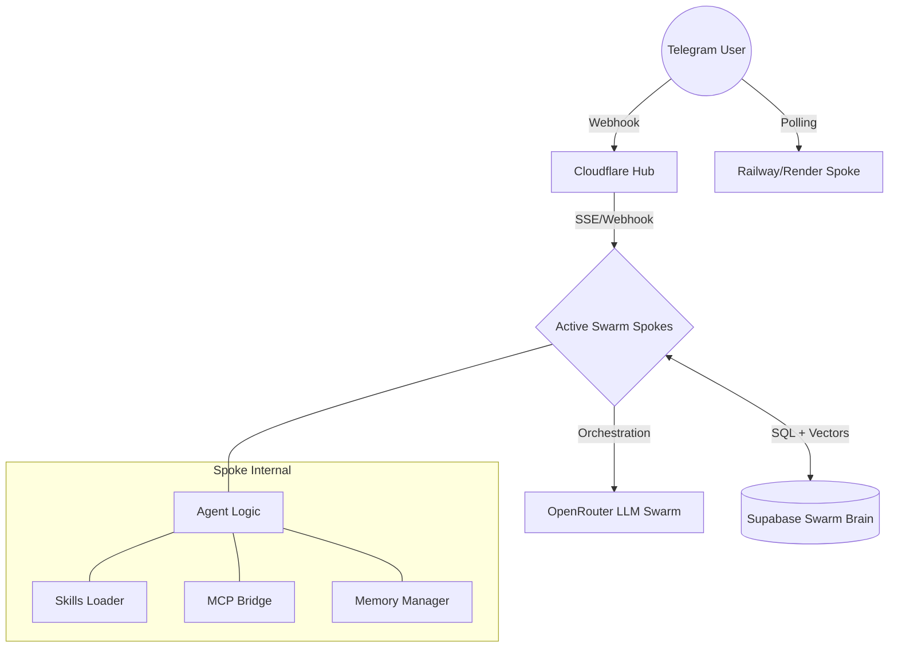

# 🏗️ Gravity Claw Architecture

The Gravity Claw system is designed for **maximum resilience** and **long-term continuity**. It employs a distributed Hub-and-Spoke model with a centralized cloud brain.

## 1. High-Level System Diagram

## 2. Layer Breakdown

### HTTP & Webhook Layer
- **Cloudflare Worker**: Acts as the "Immortal Hub". It receives Telegram updates and propagates them to active spokes.
- **Health Checks**: Standard `/health` and `/ping` endpoints for monitoring uptime.

### Orchestration Layer (`agent.ts`)
- **Orchestrator**: Analyzes user intent and selects a ranked queue of expert models.
- **Fallthrough Loop**: If a model fails or is rate-limited, the system automatically falls back to the next model in the queue.

### Memory & Knowledge Layer (`manager.ts`)
- **Semantic Memory**: Converts conversations into vectors via OpenAI embeddings and stores them in Supabase.
- **Context Assembly**: Before every LLM call, the system retrieves:
    1. Recent History (Short-term)
    2. Semantic Memories (Long-term)
    3. Knowledge Items (Static facts)
    4. Graph Context (Relationships)

### Extension Layer
- **MCP Bridge**: Connects to the Model Context Protocol for tool use.
- **Skills System**: Injects specialized behavior prompts on-the-fly.

## 3. Data Flow Narrative

1. **Input**: A user sends a message to the Telegram bot.
2. **Ingress**: The webhook hits the Cloudflare Hub, which forwards it to the active Spoke (e.g., Railway).
3. **Context Construction**: The Spoke queries Supabase for relevant past memories and history.
4. **Reasoning**: The Orchestrator picks an expert model group. The agent loops through the models until a successful response is generated.
5. **Memory Formation**: The result is logged to the conversation history, and an embedding is generated in the background to store the memory permanently.
6. **Egress**: The generated response is sent back to the user via the `grammy` framework.

## 4. Observability
- **Supabase Logs**: Audit trail of every conversation.
- **Console Monitoring**: Real-time logging of model performance and tool execution.
- **Heartbeat**: A sub-process that periodically checks system health and provides proactive recommendations.
